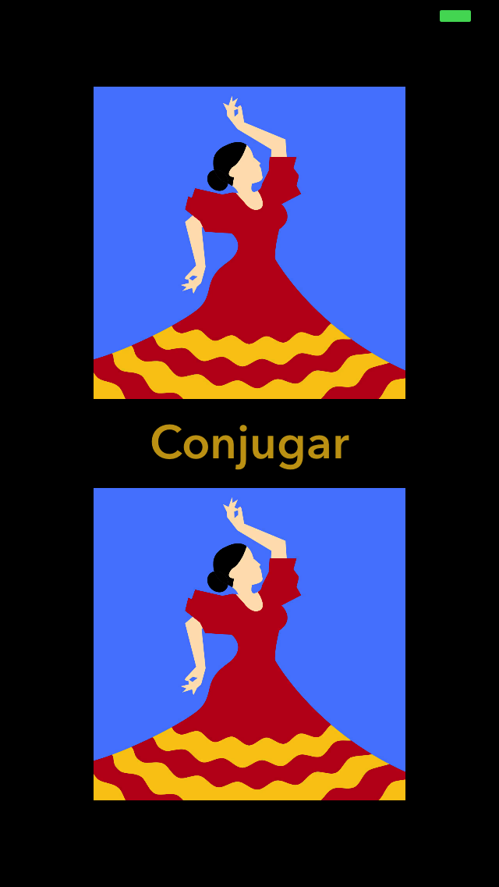
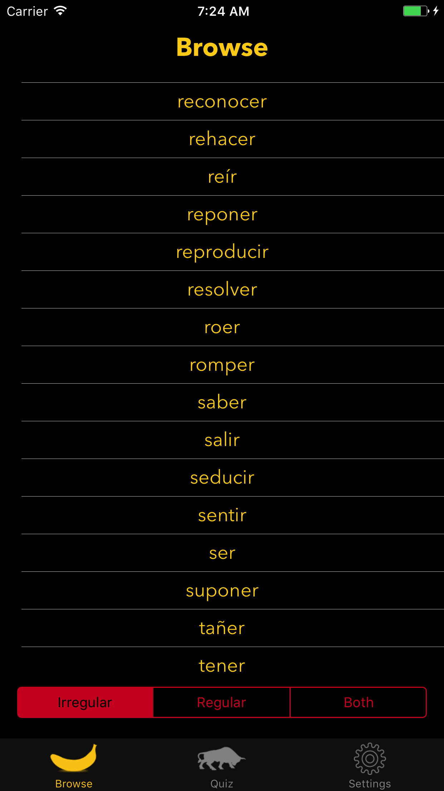
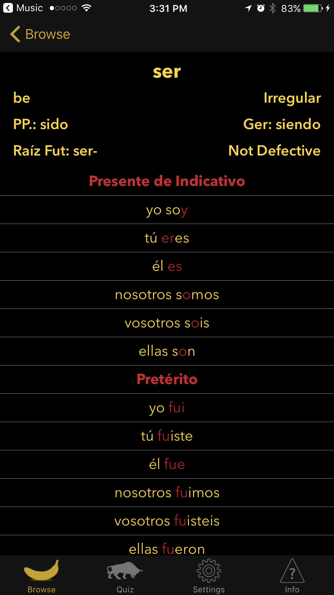
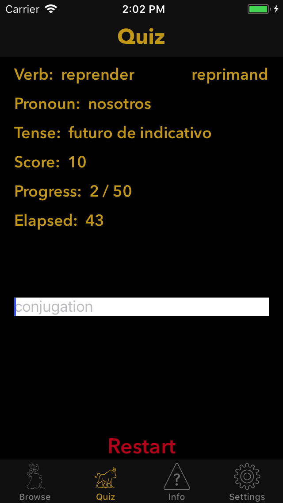
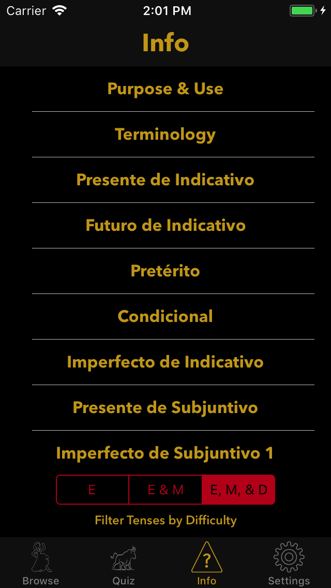
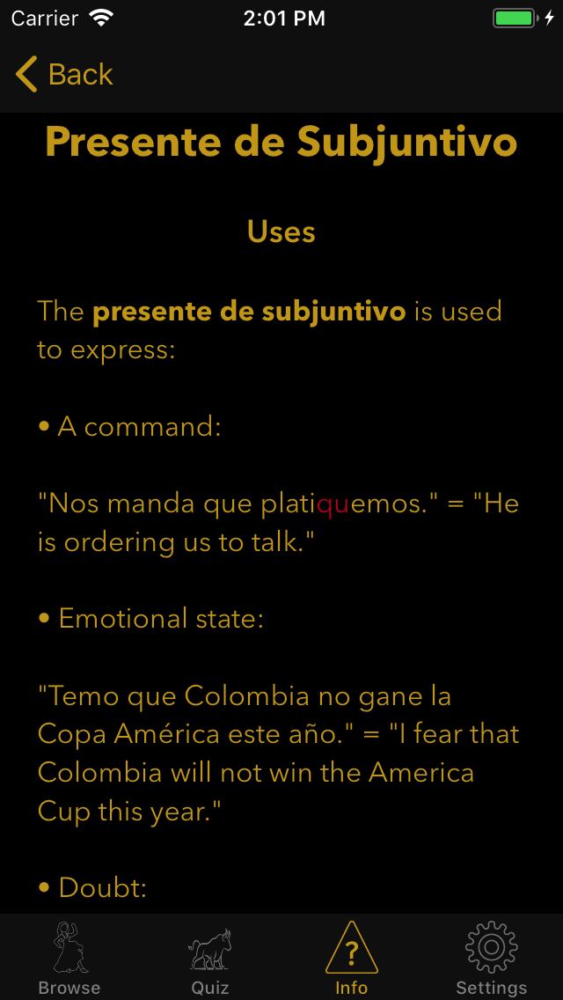

### Introduction

**Conjugar** is an iPhone™ app for learning Spanish verb conjugations. **Conjugar** conjugates most Spanish verbs, regular and irregular, in **all** Spanish verb tenses. There is a quiz mode with three difficulty levels. Results from quizzes are available in Game Center™. On a pedagogical note, **Conjugar** contains descriptions of the tenses.

**Conjugar** uses programmatic layout rather than storyboards. Thus, if you are curious about how to implement programmatic layout, **Conjugar** may be instructive.

### Installation

**Conjugar** is available for free download in the iOS App Store™. Tap the logo below to install.

Alternatively, you can clone this repo and build, using Xcode™ 9, **Conjugar** yourself. Building **Conjugar** for the simulator (but not iPhone™) causes the following warning, truncated for clarity: `objc[10192]: Class VCWeakObjectHolder is implemented in both ... Frameworks/ViceroyTrace.framework/ViceroyTrace (0x1269c97c0) and  ... AVConference (0x126857a18). One of the two will be used. Which one is undefined."`

The immediate cause of this warning is linking GameKit.framework, required for Game Center™ support. This [appears](https://forums.developer.apple.com/thread/63254) to be a vendor bug.

**Conjugar** is currently using AWS Pinpoint analytics. The two relevant frameworks are in source control, but the configuration files and folder, in particular `awsconfiguration.json`, `.amplifyrc`, and `amplify`, respectively, are excluded from source control by the `.gitignore` file. For instructions on Pinpoint configuration, see this excellent [tutorial](https://itnext.io/integrate-analytics-into-your-ios-swift-applications-with-aws-amplify-20d31fe0a20e).

### Screenshots

