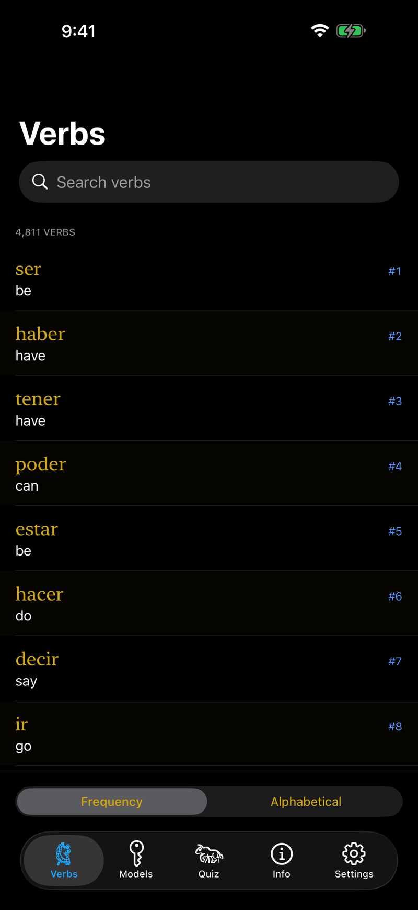
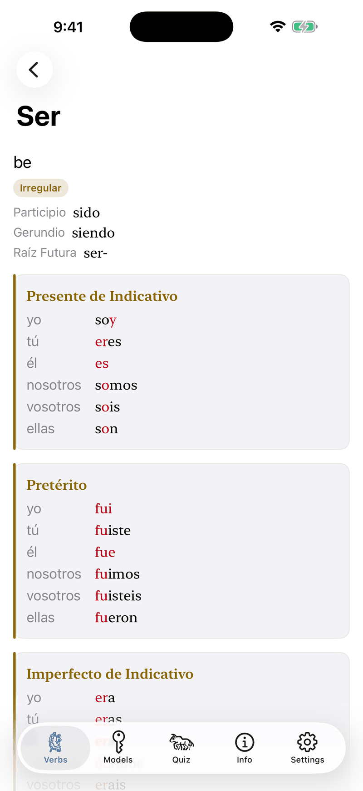
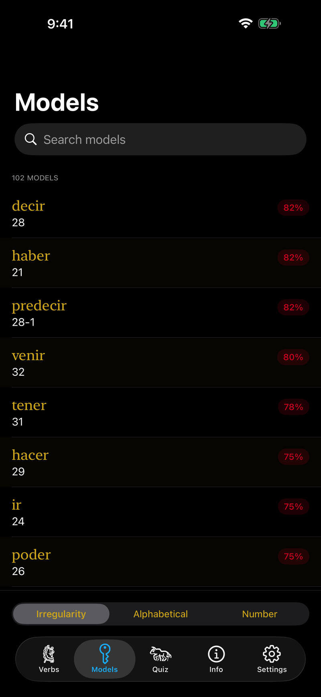
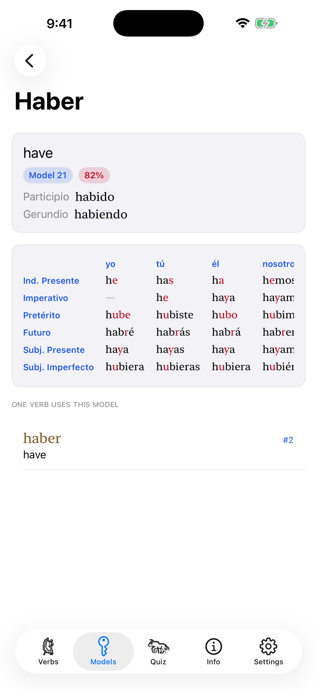
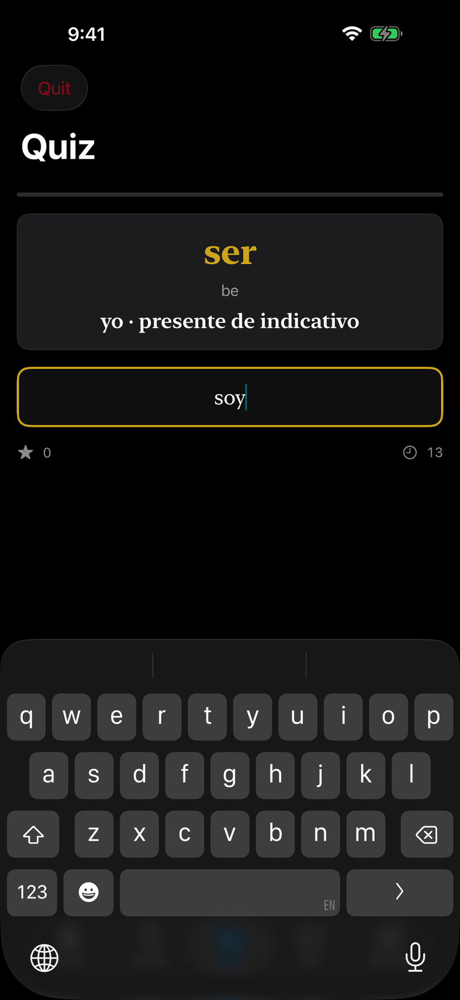
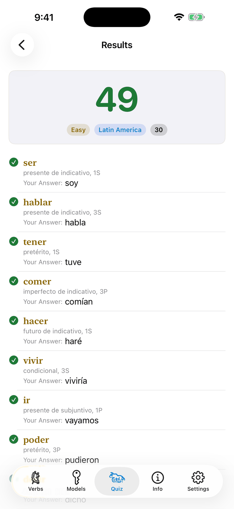
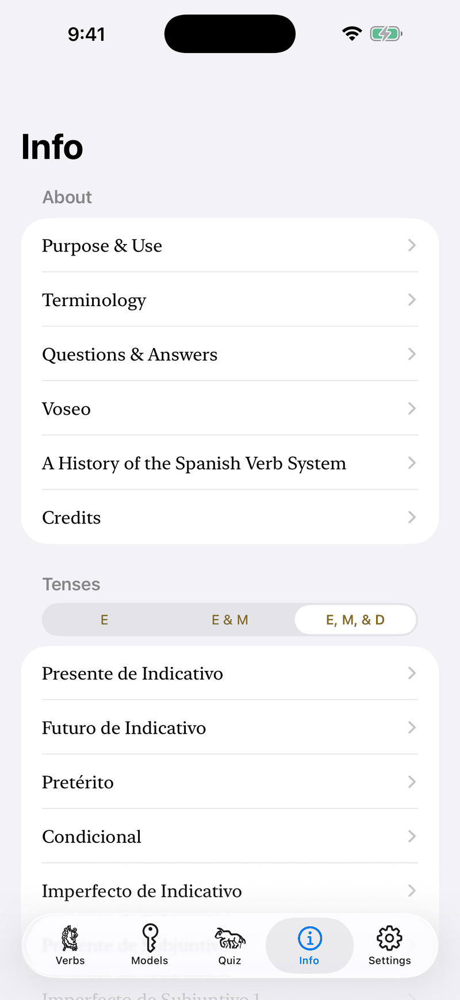
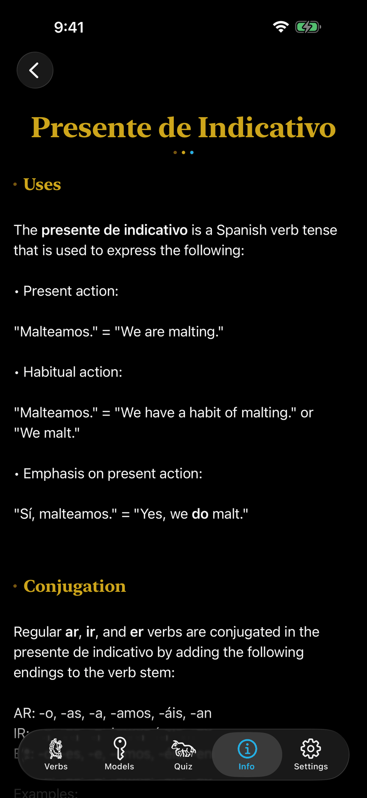
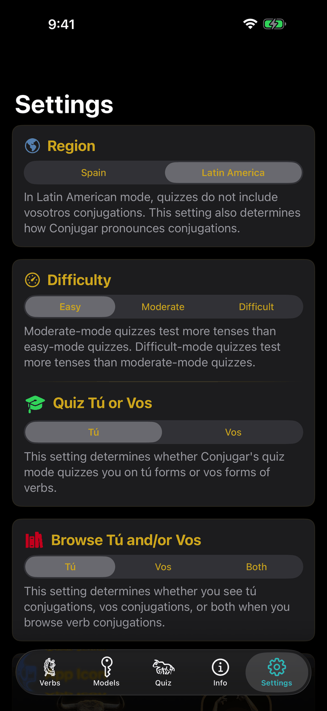
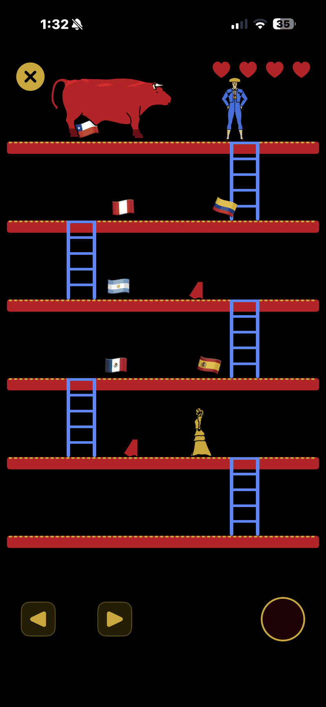

<p align="center">
  
</p>

<h1 align="center">Conjugar</h1>

**Conjugar** is an iOS™ app for learning Spanish verb conjugations. **Conjugar** conjugates 4,811 verbs, regular and irregular, in _all_ Spanish verb tenses: the eleven simple tenses, the nine compound tenses, and the non-finite forms.

**Conjugar** is available for free download in the iOS App Store™. Tap the button below to install.

<p align="center">
  <a href="https://apps.apple.com/us/app/conjugar/id1236500467"></a>
</p>

Alternatively, you can clone this repo and build **Conjugar** yourself.

I released **Conjugar** in 2017 as a UIKit app with programmatic layout, and I wrote tutorials about the two techniques it was built to demonstrate: [dependency injection](https://racecondition.software/blog/dependency-injection/) and [programmatic layout](https://racecondition.software/blog/programmatic-layout/). The dependency-injection pattern survives; every external service still arrives through the `World` container described in that post. The programmatic layout does not. In 2026 I rewrote the app in SwiftUI, replaced the original conjugation engine with a rule-composition engine, and added the features below. No `UIViewController` subclass remains.

### Features

- **Verb browser**: all 4,811 verbs, searchable and sortable by frequency of use or alphabetically. Every verb carries a frequency rank derived from the Real Academia Española's CORPES XXI corpus, from `ser` at #1 to the rarest at #4,811.
- **Conjugation views**: every tense for a given verb, with the irregular part of each form picked out in red so that the shape of an irregularity is visible at a glance. Many verbs also carry an etymology, a modern example sentence, and an attestation from Medieval Spanish.
- **Verb models**: the 102 conjugation patterns that the verbs inherit from, ranked by how irregular they are, each with a pronoun-by-tense grid and the list of verbs that follow it.
- **Tense reference**: an explanation of each Spanish tense, when to use it, and how it is formed, plus essays on terminology, *voseo*, and the history of the Spanish verb system.
- **Conjugation quiz**: three difficulty levels, partial credit for a correct skeleton with a dropped accent, a Live Activity with Dynamic Island support, and Game Center™ leaderboards.
- **AI tutor**: answers Spanish-conjugation questions on-device, powered by Apple's Foundation Models and grounded in the app's own conjugation engine, so it cannot invent forms. Requires Apple Intelligence.
- **Widgets and controls**: a "Verb of the Day" and a tappable daily quiz on the Home Screen and Lock Screen, plus two Control Center controls.
- **Regional settings**: Spain or Latin America, and *tú* or *vos*, affecting which forms the quiz asks for, which forms the browser shows, and the accent in which the app pronounces conjugations aloud.
- **Retro arcade minigame**, *Toreo por Amor*, reachable from Settings: a five-stage climb followed by a flamenco dance-off against the bull.
- **Alternate app icons**: dancer, bull, matador, or the classic 2017 icon.
- **English and Spanish** localization throughout, on iPhone and iPad.

### Screenshots

| Verb List | Verb | Verb-Model List | Verb Model | Quiz |
| --- | --- | --- | --- | --- |
|  |  |  |  |  |

| Quiz Results | Info List | Tense Description | Settings | Minigame |
| --- | --- | --- | --- | --- |
|  |  |  |  |  |

### Building from Source

**Conjugar** targets iOS 26 and builds with Swift 6. Open `Conjugar.xcodeproj` in Xcode™ and build the
`Conjugar` scheme.

Before your first build, create the gitignored `Conjugar/Secrets.xcconfig` from its template. It holds
the analytics ([TelemetryDeck](https://telemetrydeck.com)) app ID, which is not checked in:

```bash
cp Conjugar/Secrets.example.xcconfig Conjugar/Secrets.xcconfig
```

Then fill in your own `TELEMETRY_DECK_APP_ID` (or leave the placeholder; the app builds and runs
either way, and analytics simply go nowhere). **Conjugar** briefly used AWS Pinpoint for analytics years ago.
That integration is long gone, and no analytics backend, framework, or configuration file is required
to build the app.

Further documentation lives in [`docs/`](docs), starting with the annotated directory tree in
[`docs/project-structure.md`](docs/project-structure.md).

### Data sources

The verbs' frequency ranks are derived from the lemma-frequency lists of the Real Academia
Española's [CORPES XXI](https://www.rae.es/banco-de-datos/corpes-xxi) (version 1.5), published
under the [Creative Commons Attribution-ShareAlike 4.0](https://creativecommons.org/licenses/by-sa/4.0/)
licence; ties are ordered with verb counts from the
[Google Books Ngram](https://storage.googleapis.com/books/ngrams/books/datasetsv3.html) 2020
release, under [Creative Commons Attribution 3.0](https://creativecommons.org/licenses/by/3.0/).
Changes were made: pronominal lemmas are merged into their base verb, and a flagged estimate
stands in where CORPES has no lemma at all. The derived counts in
`Conjugar/Models/verbModelMap.xml` and `docs/frequencies.txt` are therefore shared under the same
Attribution-ShareAlike licence, separately from the app's AGPL. The pipeline that produces them,
with full provenance, is [`frequency/`](frequency).

The app's other content sources — Wikipedia, Project Gutenberg, government open-data portals,
sound and art licensors — are credited on the Info tab's Credits screen and in
[`asset-licenses/`](asset-licenses).

### License

If **Conjugar** is in the App Store, why is the code on GitHub? I created this app to demonstrate programmatic layout for a conference talk, and I wished to provide helpful example code for folks who were curious about that technique. I originally released **Conjugar**'s source code under the MIT License because that license is maximally convenient for would-be users of the code. This was a mistake. Some dirtbag released a _clone_ of **Conjugar** on the App Store that differed only in that it had a hideous app icon, that it requested push-notification permission, and that it crashed on launch. I have changed the MIT License to the GNU Affero General Public License in order to impose onerous requirements on would-be cloners of **Conjugar**.
